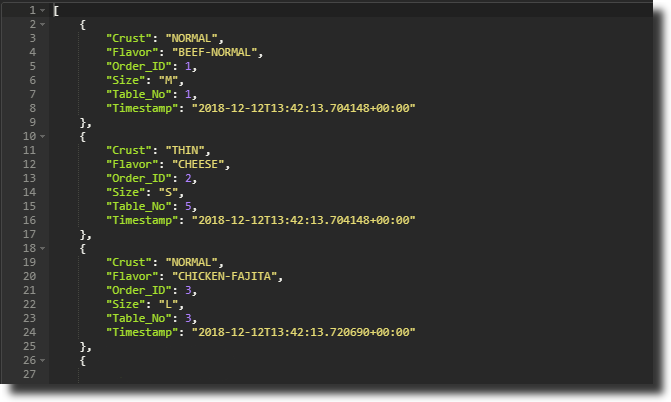

<h2><b>Order Pizza API</b></h2>

This API can be used as back-end on POS (point-of-sale) terminal
of pizza restaurant.

GET, POST and DELETE methods can be used on list of orders.

Authentication is implemented on endpoints through JWT.

### Getting Started

_Through your terminal/command prompt:_

1. Clone this repository

`git clone https://github.com/muhammadh-s/pizza_order-RESTful-API.git`

2. Install dependencies

`pip install -r requirements.txt`

3. Finally, start the app

`python server.py`

#### Endpoints

`/api` Basepath

`/auth` POST method, returns an access token

`/orders` GET method, returns list of orders

`/orders` POST method, to add an order

`/orders/{Order_ID}` DELETE method, to delete an order through Order ID

`/ui` renders a documentation webpage

### Implementation

This application is built using: Flask, connexion, marshmallow and
SQLAlchemy, hence uses Python-3.7.1

Tested through: Postman
